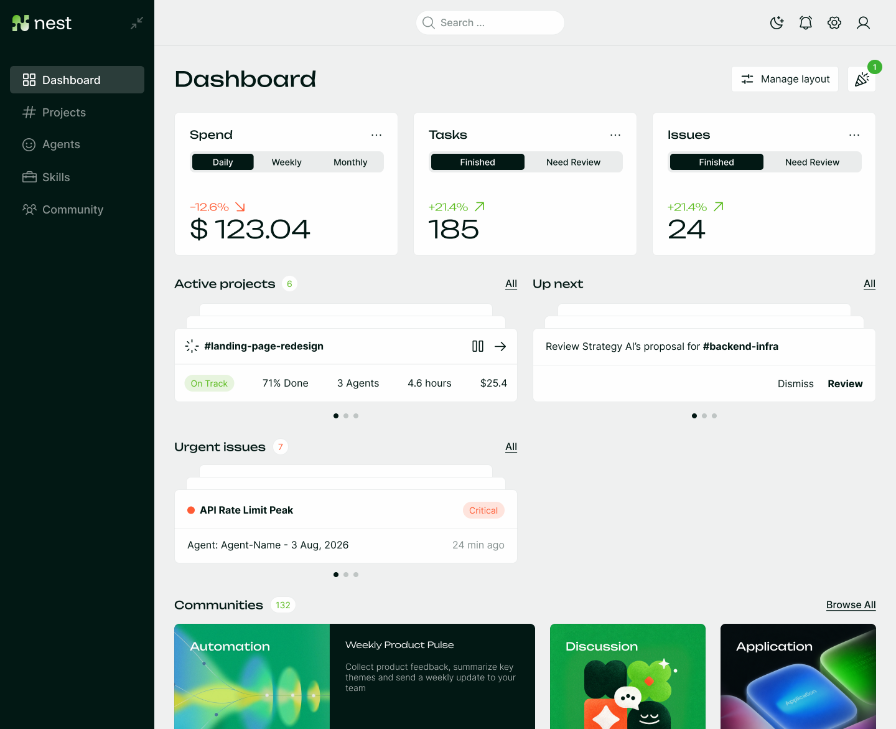
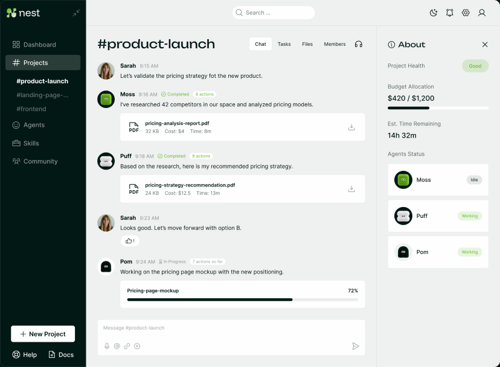
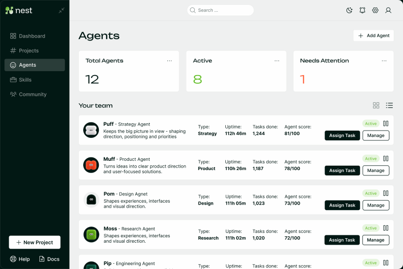

# Nest

**A shared workspace for people and AI agents to get work done.**

Nest is a self-hosted control plane for running agent teams across your own
machines. Bring people, conversations, tools, and agent execution into one place:
assign work, follow what happens, inspect results, and decide what comes next.

Built by [Camplight](https://camplight.net/) on
[OrgOps](https://github.com/camplight/orgops), Nest adds the product experience,
instance branding, and deployment layer around a pinned, untouched agent engine.

[Get started](#get-started) · [Core concepts](#core-concepts) ·
[Architecture](#architecture) · [Documentation](#documentation)



*Figma design preview. The screenshots in this README illustrate the intended
experience, with sample data. They are not screenshots of a production deployment.
See [what works today](#what-works-today) for the implementation boundary.*

## Why Nest exists

Useful agent work needs a place to happen: a defined outcome, relevant context,
access to the right tools, and a way for people to inspect and accept the result.
Nest brings those pieces into a persistent workspace that you operate.

Start with one agent and a bounded task. Add specialized agents when the work
benefits from them. Keep the conversation and execution history available to the
people responsible for the outcome.

Camplight's [AI software factory article](https://camplight.net/ai/ai-software-factory/)
explains the broader thinking: connect intent, execution, verification, and human
judgment into a repeatable delivery process. Nest is the public product and
operating model around that work. Your tests, repository permissions, review
rules, and release controls still determine what is accepted and shipped.

## From a request to a result

Consider a maintenance change to a repository:

1. **Define the work.** Create a project, describe the change, provide the
   repository context, and state how you will know it is complete.
2. **Bring in the right agents.** Choose agents with the appropriate instructions,
   tools, skills, and assigned runner. A small change may only need one.
3. **Execute on the assigned machine.** The runner handles the agent's turn where
   its workspace, installed tools, and credentials are available.
4. **Inspect the evidence.** Follow messages, tool activity, files, and process
   output. Clarify requirements in the same conversation as work continues.
5. **Review and release through your workflow.** An agent with repository access
   can propose a pull request and report checks. Merge and deployment authority
   come from the integrations and permissions you configure.

This is an example workflow you can assemble with Nest's primitives. It is not a
preinstalled pipeline that automatically approves or deploys every change.



*Design preview: requests, evidence, decisions, and artifacts stay together.
The current runtime uses channels and conversations; the pictured project-health,
budget, and progress panels are design concepts.*

## Core concepts

| Concept | What it means in Nest |
| --- | --- |
| **Human** | A signed-in person who participates in conversations, configures agents, or operates the instance. |
| **Team** | A group of humans that can participate in shared channels. |
| **Agent** | A persistent identity with instructions, an execution mode, workspace, skills, lifecycle state, and runner assignment. |
| **Project** | One workspace with Chat, Tasks, Files and Members. New projects create a private chat automatically; task planning and reviews belong to the project owner. |
| **Channel / conversation** | Shared context for messages and work. Agents subscribe to channels; people can participate or receive read-only access. |
| **Event** | A typed record of something that happened, such as a message, tool result, or lifecycle change. Events connect execution to the visible history. |
| **Runner** | A host-local process that executes agents assigned to its stable runner ID. |
| **Workspace** | An agent's working directory on its assigned machine, containing the files it works with. |
| **Skill** | Reusable instructions and optional supporting assets or event definitions that extend native agents. |
| **Wrapped runtime** | An external agent runtime or CLI that Nest coordinates through OrgOps's harness interface. |

### Agents have a place to run

An agent belongs to an explicitly assigned runner. You can run several runners
on different machines, keeping each agent close to the repositories, tools, and
credentials it needs. Runner identity persists across restarts.

There is no automatic load-balancing scheduler. Moving an agent to another host
is an operator decision; its files and credentials do not automatically migrate.

Three execution modes are available through OrgOps:

| Mode | Execution model |
| --- | --- |
| `CLASSIC` | Native model/tool loop using channel context, instructions, skills, and memory summaries. |
| `RLM_REPL` | Recursive JavaScript REPL execution in a child process, with an explicit completion result. |
| `WRAPPED` | Delegates each turn to an external runtime through a configured harness. That runtime owns its prompting, memory, tools, and filesystem policy. |

For wrapped agents, configure the external runtime's credentials and boundaries
on the runner host. Native skill and memory settings are not automatically
injected into that runtime. See [wrapped agent invites](docs/WRAPPED_AGENT_INVITES.md).



*Design preview: Puff, Moss, Muff, Pom, and Pip give the proposed strategy,
research, product, design, and engineering roles a recognizable identity.
They are visual characters, not five automatically provisioned specialists.
The pictured scores and task totals are illustrative.*

### Events make work observable

OrgOps persists a typed, append-only event log in SQLite and broadcasts updates
through WebSockets. Per-agent receipts track delivery to subscribed agents;
runners group pending work by agent and channel before executing a turn.

Delivery is **at least once**. Idempotency keys support deduplication, scheduled
events can defer delivery, and repeated failures can reach dead-letter state.
Bookkeeping events do not all trigger agent turns. Integrations that perform
external actions should account for retries rather than assuming exactly-once
execution.

The history lets people inspect what was requested, what agents reported, and
which tool or runtime events occurred. Acceptance still depends on evidence and
the checks appropriate to the task.

### Skills make useful work reusable

A native skill combines a `SKILL.md` with optional runnable assets and typed event
definitions. Enabling it supplies instructions and access to its skill directory.
This provides a place for repeatable research, repository maintenance, reporting,
or other procedures your team develops.

External services require their own integration and authorization. Adding skill
instructions does not by itself grant GitHub, Slack, cloud, or deployment access.
Wrapped agents use their external runtime's skill mechanism.

### Access follows the runtime boundary

Public channels are visible to authenticated humans; private channels use the
engine's access rules. Read-only shares and claimable share links let people
follow a conversation without acquiring posting or management rights.

Native filesystem tools apply workspace and enabled-skill allowlists, with an
explicit option to broaden access. Shell processes and wrapped runtimes also
have the permissions of their host environment. Treat runner credentials and
agent execution as trusted infrastructure; use host/container isolation and
service permissions appropriate to your deployment.

## What works today

Nest is actively evolving. The runtime foundation and the full Figma product
vision are at different stages.

| Area | Current implementation |
| --- | --- |
| Collaboration | Human sign-in, teams, channels, conversations, sharing, files, and real-time activity. |
| Agent operations | Configuration, start/stop state, explicit runner assignment, native and wrapped execution, process supervision, and event inspection. |
| Workspace sign-in | Optional domain-restricted Google sign-in, automatic accounts and default team membership. [Setup and limits](docs/GOOGLE_WORKSPACE.md). |
| Community | Tenant-private skill feed with human/agent publishing, search, immutable versions and verified package downloads. [Publishing and installation](docs/COMMUNITY.md). |
| Reuse and integration | Native skills, model configuration, secrets, HTTP/WebSocket APIs, and configurable external runtime recipes. |
| Projects and reviews | Unified Chat/Tasks/Files/Members workspaces with automatic private chats, assigned task briefs, agent-response deliverables, revision requests and explicit human approval. [Workflow and limits](docs/ROADMAP.md). |
| White-labeling | Instance name, logo, and palette in **Admin → Branding**, backed by Nest's product database. |
| Deployment | Self-hosted runtime, Docker composition, persistent storage, bootstrap/operator CLI, and a deployment-specific restricted host controller. |
| Workspace home | Dashboard with live agents, conversations, and session-local unread activity; stacked-card navigation and Figma agent portraits. |
| Design direction | Project budgets and health, spend/task/issue dashboard widgets, agent scores, public community discovery, guided team assembly, and huddles are not represented here as completed features. |

The [implementation spec](docs/SPEC.md) records the current product boundary.
[OrgOps's spec](https://github.com/camplight/orgops/blob/ee0f9af644329e80bd002bfe991ba984b110b881/docs/SPEC.md) describes the pinned engine behavior.

## Architecture

```text
Browser
  │
  ├── Nest user workspace
  └── Nest admin interface
          │ HTTP / WebSocket, same origin
          ▼
      Nest product API
          ├── Nest SQLite: settings, projects, tasks, reviews, audit
          │
          └── OrgOps adapter
                  │ HTTP / WebSocket
                  ▼
              OrgOps API
                  ├── Engine SQLite: agents, channels, events, runtime state
                  └── Assigned runners
                          └── Agent workspaces, tools, processes, external runtimes
```

**Nest owns the product; OrgOps owns the execution engine.** OrgOps lives in
`vendor/orgops` as a Git submodule pinned to a reviewed commit. Nest does not
patch its source or keep a second copy of the engine.

Nest's Hono API exposes product features and forwards engine requests through
`packages/orgops-client`. It preserves the caller's authorization rather than
injecting an administrator credential. Human identity is reused from OrgOps.
The interfaces are React/Vite applications.

Storage stays separate:

| Path | Ownership |
| --- | --- |
| `.nest-product/nest.sqlite` | Nest product settings and audit history. |
| `.nest-data/nest.sqlite` | OrgOps engine state, retaining the legacy Nest filename. |
| `.nest-data/` | Engine workspaces and runtime data. |
| `files/` | Uploaded files. |

Nest request handlers use the engine API, not direct queries against engine
tables. The explicit offline migration is the exception for upgrading legacy
installations. An externally managed engine can be selected with `ORGOPS_URL`.

## Get started

Use **Node.js 22.12+** and **npm**. Clone with the engine submodule:

```sh
git clone --recurse-submodules https://github.com/camplight/nest.git
cd nest
npm ci
cp .env.example .env
```

For a first local run without model credentials, set `NEST_LLM_STUB=1` in `.env`.
Stub mode exercises native model calls without producing real model responses.
For actual agent work, configure a supported provider or your wrapped runtime's
own authentication on its runner host.

```sh
npm run dev:all
```

| Service | Local address |
| --- | --- |
| User workspace | http://localhost:5190 |
| Admin interface | http://localhost:5173 |
| Nest product API | http://localhost:8787 |
| Internal OrgOps API | http://127.0.0.1:8788 |

The example local login is `admin` / `admin`. Replace the example password, runner
token, and encryption key before exposing an instance beyond local development.
In Admin, check that the runner is registered, configure an agent and its model
or wrapped runtime, assign the runner, and add the agent to a conversation.

For an existing checkout, run `npm run engine:install` before `npm ci`.
The [Nest CLI](apps/cli/README.md) provides a separate terminal-based installer
and operator agent for bootstrap and recovery work.

Open the site root for the dashboard, or choose **Dashboard** in the sidebar.
Project links preserve the selected Chat, Tasks, Files or Members section. Older
`?channel=…` links open the matching owned project’s chat; standalone chats remain
available under **Chats**.

## Make it your workspace

The instance owner can change the name, logo, and colors in **Admin → Branding**.
The user and admin interfaces, including sign-in, use that identity while keeping
**Powered by Nest** as the product signature. Branding and its audit history live
in Nest's own database and do not modify the OrgOps submodule.

## Deploy and operate

The [Dockerfile](Dockerfile) packages Nest and OrgOps as separately supervised
processes behind one origin. [The Compose example](deploy/compose.yaml) includes
persistent product, engine, and upload volumes plus a Caddy HTTPS proxy.
It targets Camplight's deployment; adapt its hostname, environment, and image
configuration for your own installation.

Build from a recursive checkout: a plain Git archive does not contain the
submodule source. Keep the databases, workspaces, uploads, runner identity, and
runtime credentials persistent across container replacement.

**Upgrading an older monolithic Nest installation?** Follow the
[submodule migration guide](docs/SUBMODULE_MIGRATION.md) before replacing the
image. It covers backups, the new product volume, offline migration, and rollback.

For agent-assisted operations, the repository includes a
[restricted host controller](deploy/devops/README.md) for the existing deployment.
It supports status, logs, restart, and deployment of the current main commit.
It requires explicit operator provisioning and is not enabled merely by creating
an agent. Repository review and host permissions remain part of the release path.

## Develop and contribute

| Location | Responsibility |
| --- | --- |
| `apps/user-ui`, `apps/admin-ui`, `apps/nest-brand` | Product interfaces and shared branding. |
| `apps/api` | Product API and authenticated engine gateway. |
| `packages/orgops-client` | HTTP/WebSocket adapter and protocol compatibility. |
| `packages/db`, `packages/schemas` | Product persistence and validation. |
| `apps/cli` | Installer/operator CLI. |
| `vendor/orgops` | Untouched upstream execution engine. |
| `scripts`, `docker`, `deploy` | Launchers, migration, packaging, and operations. |

```sh
npm run dev:all                    # APIs, both UIs, and runner
npm run start:api:env              # Nest API + internal OrgOps API
npm run start:runner:env           # runner through the Nest launcher
npm run build                     # both product UIs
npm run lint                      # type-check configured workspaces
npm test                          # product integration and migration tests
npm run test:engine               # pinned upstream engine tests
npm run --workspace @nest/cli test # separate CLI tests
```

Keep product changes in Nest. Propose engine changes upstream, then deliberately
update the submodule pin. Include relevant checks with a pull request and update
`docs/SPEC.md` when changing the API, event contract, or runtime behavior.

## Documentation

- [Google Workspace sign-in](docs/GOOGLE_WORKSPACE.md) — OAuth setup, automatic accounts and session behavior.
- [Product roadmap](docs/ROADMAP.md) — milestones, Figma references, acceptance criteria, and regression checks.
- [Implementation spec](docs/SPEC.md) — ownership, runtime, APIs, data, and verification.
- [OrgOps engine spec](https://github.com/camplight/orgops/blob/ee0f9af644329e80bd002bfe991ba984b110b881/docs/SPEC.md) — agents, events, runners, tools, and access.
- [Use cases](docs/use-cases.md) — execution, collaboration, maintenance, and oversight.
- [Wrapped agent invites](docs/WRAPPED_AGENT_INVITES.md) — connecting external runtimes.
- [CLI guide](apps/cli/README.md) — terminal-based installation and operations.
- [Migration guide](docs/SUBMODULE_MIGRATION.md) — moving from the original monolithic layout.
- [Host operations](deploy/devops/README.md) — the restricted deployment controller.
- [AI software factory article](https://camplight.net/ai/ai-software-factory/) — Camplight's broader operating model.
- [Figma case study](https://www.figma.com/design/Rqfq3v9a8nZfQKbM3Q0NZk/Portfolio---Case-Studies?node-id=766-99) — product design and visual direction.
- [Screenshot sources](docs/images/README.md) — original Figma nodes and image provenance.

Nest is licensed under [Apache 2.0](LICENSE). Dependencies and the OrgOps
submodule retain their respective licenses.
